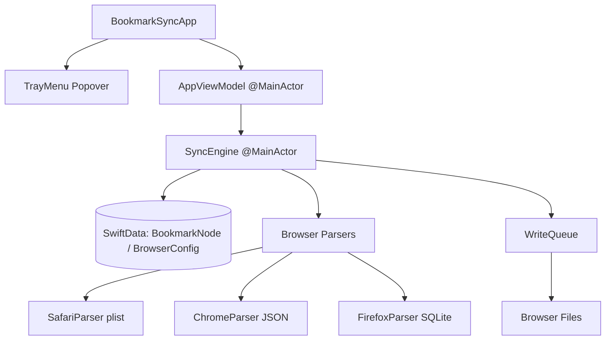

# BookmarkSync Project Self-Guidance & Architectural Record

Use this document to quickly onboard and resume development from scratch. It details the system architecture, component design, and critical, hard-earned bug fixes.

---

## 1. System Architecture



### Core Components
- **`BookmarkSyncApp.swift`**: Entry point. Sets up popover `MenuBarExtra` and launches the primary `SyncEngine` on start.
- **`TrayMenu.swift` / `BackupsView.swift`**: SwiftUI popover views. Enables toggling browser profiles, viewing backups, and displaying live diff queue logs.
- **`AppViewModel.swift`**: Unified reactive state holder. Manages list of discovered browser profiles, diff history queue, and full disk access checks.
- **`SyncEngine.swift`**: The synchronization heart. Fetches current browser bookmark trees, merges them against the global state, calculates differences, and triggers database/file updates.
- **`FileWatcher.swift`**: Wrapper around macOS `FSEvents` system. Watches active browser directories recursively on a background thread.
- **`WriteQueue.swift`**: Thread-safe serial write pipeline. Queues updates for active browsers and defer-writes them if the target browser process is running to avoid in-memory cache clobbering.

---

## 2. Hard-Earned Engineering Lessons & Bug Fixes

### A. Project Structure & Code Signing Persistence
- **The Issue**: Manual changes inside Xcode (`.xcodeproj`) were wiped out whenever `xcodegen generate` was executed.
- **The Fix**: 
  - `properties` must be nested under target `info` (not `settings`) in `project.yml` for `LSUIElement: true` to compile correctly to `Info.plist` (hiding the app from the Dock).
  - Code signing configurations must be defined in `project.yml` target `settings` to persist through generations:
    ```yaml
    settings:
      CODE_SIGN_STYLE: Automatic
      DEVELOPMENT_TEAM: MCC7MZGLZ8
    ```

### B. SwiftUI Picker Collapsing & Console Warnings
- **The Issue**: 
  - Initializing optional `@State` selection to `nil` caused a persistent console warning: *"Picker: the selection 'nil' is invalid... undefined results"*.
  - Wrapping `ScrollView` in dynamic popovers caused the height to collapse to `0`.
- **The Fix**:
  - Wrapped `Picker` inside `if selectedConfigId != nil` and populated selection immediately via parent `VStack` `.onAppear` and `.onChange(of: configs)`.
  - Set explicit ScrollView height dynamically using `min(count * 24, 150)` when items exist, rendering static text directly when empty.

### C. SwiftData Detached Context Crash
- **The Issue**: Accessing deleted/modified `BookmarkNode` entities inside the serial background write queue caused a fatal crash: *"This backing data was detached from a context without resolving attribute faults"*.
- **The Fix**:
  - Before calling `modelContext.delete` on stale database nodes, the sync engine maps/clones `merged` nodes into brand new, completely unmanaged `BookmarkNode` instances.
  - The clean unmanaged nodes are safely saved to the database and passed to the asynchronous `WriteQueue` without any active context coupling.

### D. Zero-Noise & Highly Reactive File Watching
- **The Issue**: Watching entire application support directories recursively triggered high CPU usage and loops due to unrelated browser writes (history, cookies, session restore).
- **The Fix**:
  - `SyncEngine` manages the `FileWatcher` dynamically, only watching the specific parent directories of currently *enabled* profiles.
  - In FSEvents callback, all events are strictly filtered to ignore unrelated files and trigger sync *only* when the changed path matches the exact bookmark file (`Bookmarks`, `Bookmarks.plist`, `places.sqlite`).
  - Added workspace notification observer for `NSWorkspace.didTerminateApplicationNotification` in `WriteQueue`. Pending writes are flushed instantly the moment a user closes a running browser.

### E. Unified Hierarchy Mismatch & Rename Loop Resolution
- **The Issue**: 
  - Chrome included its root folders in results (nesting child bookmarks one level deep), whereas Safari and Firefox omitted root folders (placing child bookmarks at `parentId: nil`). This mismatch caused endless delete/add loops.
  - Safari has no bookmark-level `mtime` modification timestamps, resulting in fallback `Date()` (current time) marking Safari bookmarks as "always newer" than Chrome's actual modifications.
- **The Fix**:
  - **Flattened Roots**: `ChromeParser.read()` updated to skip traversing root folders, setting immediate children to `parentId: nil`. Flat structures now align globally.
  - **Robust URL Normalization**: Added `normalizeURL` utilizing Swift `URL` parsing to strip protocols (`http`/`https`), host prefixes (`www.`), trailing slashes (`/`), query strings, and hashes from the composite `id`. Complex URL variations map to the identical node ID.
  - **Safari Timestamp Pollution**: Set Safari node `mtime` fallback to a constant epoch date `Date(timeIntervalSince1970: 0)` (Jan 1, 1970).
  - **SyncEngine Rename Sorter**: Implemented logic in `SyncEngine.merge` that prioritizes renames by checking which browser changed *relative to the DB sync state* (`stateNode.title`). Conflicting dual-direction queues are resolved cleanly in a single winner direction.

### F. Lock-Resilient Sync via Observed Profile State
- **The Issue**: When `SyncEngine` dispatched writes to browsers that were currently open (e.g., Safari locking `Bookmarks.plist`), the write queued up. On the next sync cycle, comparing the old disk file against the speculative "Hub" state falsely made the engine believe the user locally *deleted* the pending items, triggering cascading deletions across all synced browsers.
- **The Fix**:
  - `SyncEngine` now strictly maintains an `observedStateData` (JSON-encoded `BookmarkNodeRecord`s) attached to `BrowserConfig`.
  - The observed state is *only* ever updated to match what is successfully parsed from the physical disk—never speculatively.
  - If a file write is blocked, the disk file matches the old observed state natively, registering `0` changes, and simply deferring the operation until the browser is closed and accepts the write.

### G. Parser Folder Normalization & Conflict Resolution
- **The Issue**: `SafariParser` generated folder IDs using unique UUIDs, while `ChromeParser` generated them using the folder's name. This caused massive duplication/deletion loops because the Hub couldn't reconcile identically-named folders across browsers. Additionally, concurrent modification (one profile deletes, another renames) heavily favored deletion.
- **The Fix**:
  - **Title-Based Folder IDs**: `SafariParser` and `FirefoxParser` now explicitly generate unique folder IDs based on their title (name), perfectly aligning with Chrome's approach. Same-named folders now cleanly merge natively in the Hub.
  - **Robust Prefix Stripping**: `BookmarkNode.stripProfileSetPrefix` was hardened using segment-splitting (max 2 splits) to prevent folder names containing colons (e.g., `My: Folder`) from corrupting the ID routing logic.
  - **Updates Trump Deletes**: Deletions are now strictly validated against `observedStateData`. If a profile attempts to delete a node that has been modified (renamed/moved) by another profile since its last sync, the deletion is rejected and the node is preserved or resurrected.
