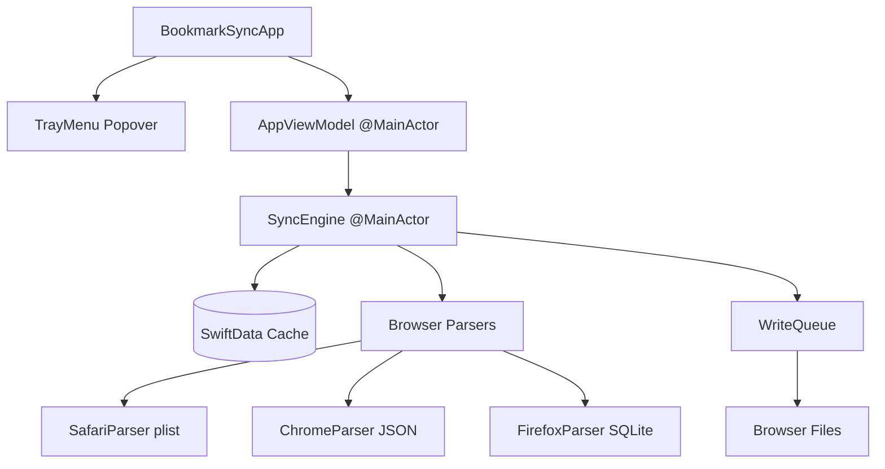

# BookmarkSync

A local-first, serverless macOS tray application that dynamically synchronizes bookmarks across multiple browsers (Safari, Chromium-based browsers, and Firefox) without relying on external cloud APIs or databases. 

By directly merging local browser bookmark files, it leverages each browser's native cloud synchronization mechanisms (iCloud, Google Sync, Firefox Sync) to seamlessly propagate updates to all of your other devices.

---

## 🚀 Key Features

* **Local-First & Private**: Operates strictly within the macOS sandbox. No external APIs, servers, or cloud credentials required.
* **Unified N-Way Merge**: An orchestrator resolves updates, deletes, and insertions dynamically across all connected browsers using a centralized SwiftData cache.
* **Dynamic File Watching**: Monitors parent directories of *only enabled browser profiles* recursively via `FSEvents`. Automatically ignores unrelated system changes (caches, logs, history) using precise file-level filters (`Bookmarks`, `Bookmarks.plist`, `places.sqlite`).
* **Zero-Latency Write Pipeline**: Pending writes are safely queued to prevent cache clobbering while a browser is running. Observing application terminations instantly flushes writes the moment you close a browser.
* **Lock-Resilient Sync via Observed Profile State**: Strict tracking of each profile's observed state prevents cascading deletions when browser files are locked, deferring writes until the target is ready.
* **Perfect URL Normalization**: Built-in Swift `URL` normalizer strips protocols (`http`/`https`), host subdomains (`www.`), trailing slashes (`/`), query parameters, and hashes to match different URL formats to a single, stable composite ID.
* **Universal Folder Identity**: All browser parsers construct deterministic, title-based identities for folders, guaranteeing robust merging of same-named folders across Safari, Chrome, and Firefox.
* **Robust Rename Resolution & Conflict Handling**: Detects renames by comparing each browser's state against the last known database sync state. In conflicting situations (e.g., Profile A deletes, Profile B renames), updates and renames always win over deletions, preserving data intact.
* **Epoch-Based Timestamping**: Safe epoch fallback (`Jan 1, 1970`) for Safari bookmarks prevents Safari's blank timestamps from overriding active edits from other browsers.
* **Modern Menu Bar UI**: A lightweight SwiftUI popover shows real-time status indicators (green dots for recent sync), dynamic profile toggles with native application icons, scrollable diff history queues, and a dedicated Backups View.

---

## 🛠️ Architecture



### File Hierarchy
```text
├── BookmarkSync/
│   ├── BookmarkSyncApp.swift     # Entry point & SwiftUI lifecycle
│   ├── TrayMenu.swift            # Menu Bar Extra popover UI
│   ├── Core/
│   │   ├── BrowserDiscoverer.swift # Dynamic Chromium/Firefox profiles scanning
│   │   ├── FileWatcher.swift     # Core FSEvent recursive directory monitor
│   │   ├── SyncEngine.swift      # N-way merge engine & DB manager
│   │   └── WriteQueue.swift      # Thread-safe serial write pipeline
│   ├── Models/
│   │   └── BookmarkNode.swift    # SwiftData node model & URL normalizer
│   ├── Parsers/
│   │   ├── BrowserParser.swift   # Read/Write protocol
│   │   ├── ChromeParser.swift    # JSON decoder & WebKit timestamp parser
│   │   ├── SafariParser.swift    # Plist decoder & URIDictionary writer
│   │   └── FirefoxParser.swift   # SQLite wrapper (places.sqlite)
│   └── Views/
│       └── BackupsView.swift     # Dynamic backups restoration manager
├── project.yml                   # XcodeGen declaration & build configuration
└── AGENTS.md                     # Architectural record & onboarding document
```

---

## 🏗️ Building and Running

The project layout is defined and generated dynamically via `XcodeGen`.

### Prerequisites
Ensure `xcodegen` is installed:
```bash
brew install xcodegen
```

### Steps to Generate and Build
1. Generate the Xcode project from the root folder:
   ```bash
   xcodegen generate
   ```
2. Open `BookmarkSync.xcodeproj` in Xcode.
3. Select the `BookmarkSync` scheme and build (`Cmd + B`) or run (`Cmd + R`).

### Custom Configurations (in `project.yml`)
* **Agent App Settings**: The application compiles as a background agent (`LSUIElement: true`), hiding it from the macOS Dock. Only the menu bar tray icon remains visible.
* **Code Signing**: Automatic code signing is pre-configured with team ID `MCC7MZGLZ8`.
* **Diagnostic Noise Suppression**: Scheme environment variable `OS_ACTIVITY_MODE: disable` is configured to automatically silence noisy Apple Intelligence / Greymatter diagnostic warnings in the Xcode console.

---

## 📂 Detailed Onboarding & History

For in-depth explanations on the dynamic file watcher, SwiftUI picker bugs, detached SwiftData context crashes, and lock-resilient synchronization, refer to the [AGENTS.md](file:///Users/yak0001v/projects/bookmarksync/AGENTS.md) file inside the project root.
